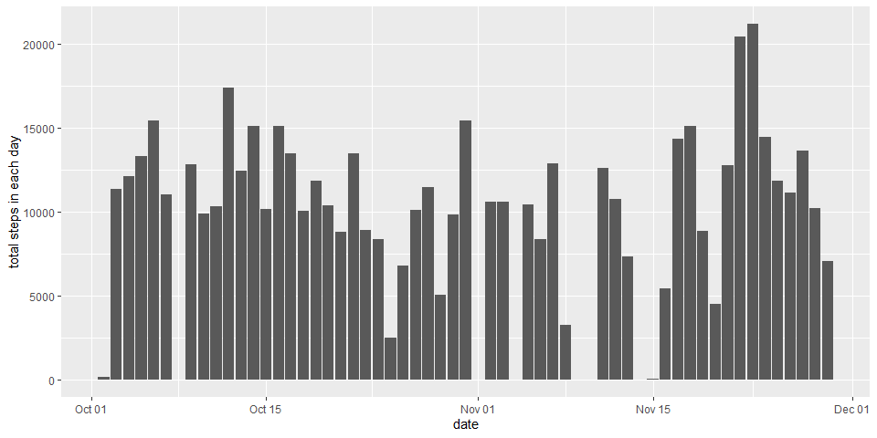
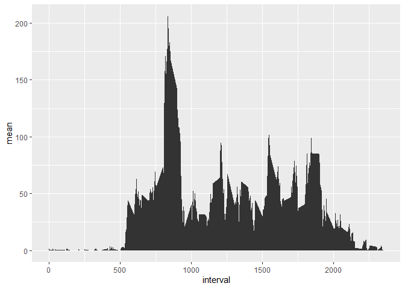
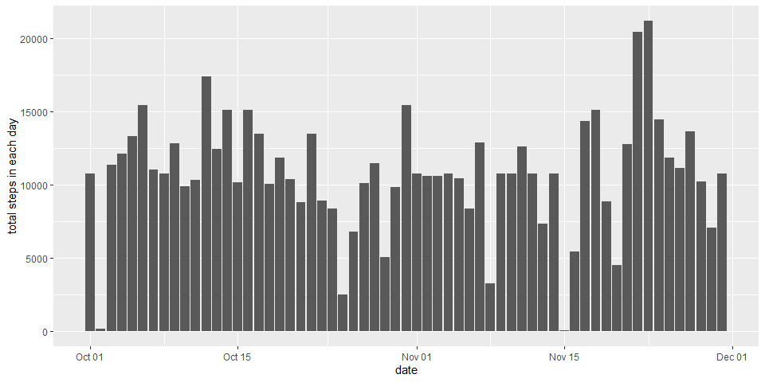
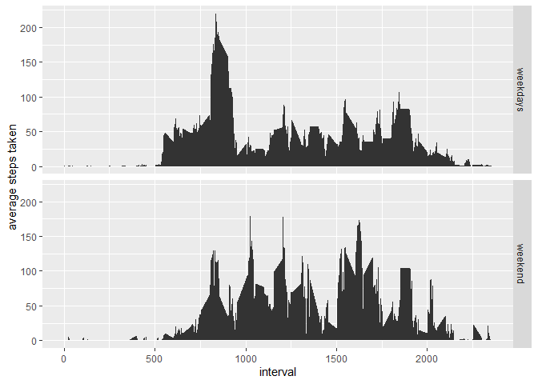

## Loading and preprocessing the data  
The data and the required packages were loaded with the following code:  

```r
library(dplyr)
library(tidyr)
library(ggplot2)
act <- read.csv(unz('activity.zip', 'activity.csv'), header = TRUE) %>% tbl_df
```

The date column in the data frame was transformed into a Date object:  

```r
act$date <- as.character(act$date) %>% as.Date('%Y-%m-%d')
```

## What is mean total number of steps taken per day?  
The mean and median of the total steps taken per day were calculated by firstly grouping the data by the column date, and the using the summarise function.

```r
act_gpdate <- group_by(act, date)
stsum_d <- summarise(act_gpdate, sum = sum(steps), 
                     mean = mean(steps), median = median(steps, na.rm = T))
stsum_d
```

```
## # A tibble: 61 x 4
##    date         sum   mean median
##    <date>     <int>  <dbl>  <dbl>
##  1 2012-10-01    NA NA         NA
##  2 2012-10-02   126  0.438      0
##  3 2012-10-03 11352 39.4        0
##  4 2012-10-04 12116 42.1        0
##  5 2012-10-05 13294 46.2        0
##  6 2012-10-06 15420 53.5        0
##  7 2012-10-07 11015 38.2        0
##  8 2012-10-08    NA NA         NA
##  9 2012-10-09 12811 44.5        0
## 10 2012-10-10  9900 34.4        0
## # ... with 51 more rows
```
If all the results should be listed, use the code:

```r
View(stsum_d)
```
A histogram for how many steps taken each day was plotted with the ggplot2 package:

```r
a <- ggplot(stsum_d, aes(date, sum))
a+geom_col()+labs(y = 'total steps in each day')
```

<!-- -->

## What is the average daily activity pattern?
For averaging across all days,  the data were firstly grouped by the column interval. And then the function summarise was used to calculate the average steps taken across all days for that interval. ggplot2 package was applied to produce the figure:

```r
act_gpint <- group_by(act, interval)
stsum_i <- summarise(act_gpint, mean = mean(steps, na.rm = TRUE))
qplot(interval, mean, data = stsum_i, geom = 'area')
```

<!-- -->

The 835 interval across all days contained the most steps.

```r
filter(stsum_i, mean == max(mean))
```

```
## # A tibble: 1 x 2
##   interval  mean
##      <int> <dbl>
## 1      835  206.
```
## Imputing missing values  
There are 2304 missing values in the column steps:

```r
apply(act, 2, is.na) %>% apply(2, sum)
```

```
##    steps     date interval 
##     2304        0        0
```
The missing values were imputed with the mean of the corresponding 5-minute interval:

```r
imputed <- act
for(i in 1:nrow(imputed)){
      if(is.na(imputed$steps[i])){
            imputed$steps[i] <- rep(stsum_i$mean, time = nrow(imputed)/nrow(stsum_i))[i]
      }
}
```

The mean and the median of the imputed data were calculated just as above-mentioned:

```r
im_gpd <- group_by(imputed, date)
sumim <- summarise(im_gpd, mean = mean(steps), median = median(steps))
```
If all the results should be listed, use the code:

```r
View(sumim)
```
A histogram was constructed with the imputed data to show comparison to the non-imputed data:

```r
qplot(date, steps, data = imputed, geom = 'col', ylab = 'total steps in each day')
```

<!-- -->
It can be seen that some bars, without height, in the previous figure were erected because the missing values were filled by imputation.  However, for those days where the values were 0, which means no activity, imputation cannot change them.

## Are there differences in activity patterns between weekdays and weekends?
A new factor was created through using the function weekdays. This factor indicates whether a recorded day is a weekday or weekend:

```r
weekd_e <- mutate(imputed, weekdays = (weekdays(act$date) == 'Saturatday'|weekdays(act$date) == 'Sunday' )%>%factor(labels = c('weekdays', 'weekend')))
weekd_e
```

```
## # A tibble: 17,568 x 4
##     steps date       interval weekdays
##     <dbl> <date>        <int> <fct>   
##  1 1.72   2012-10-01        0 weekdays
##  2 0.340  2012-10-01        5 weekdays
##  3 0.132  2012-10-01       10 weekdays
##  4 0.151  2012-10-01       15 weekdays
##  5 0.0755 2012-10-01       20 weekdays
##  6 2.09   2012-10-01       25 weekdays
##  7 0.528  2012-10-01       30 weekdays
##  8 0.868  2012-10-01       35 weekdays
##  9 0      2012-10-01       40 weekdays
## 10 1.47   2012-10-01       45 weekdays
## # ... with 17,558 more rows
```
A line graph was then created to exihibite the pattern difference between weekdays and weekend activity. The graph was built by firstly grouping the data by the newly created column weekdays, and then using the ggplot2 system:

```r
weekde_gp <- group_by(weekd_e, weekdays, interval)
sumwkde <- summarise(weekde_gp, mean = mean(steps))
b <- ggplot(sumwkde, aes(interval, mean))
b+geom_area()+labs(y = 'average steps taken')+facet_grid(weekdays~.)
```

<!-- -->

It can be seen that there is a high peak at around 800 interval in the weekdays plot, after that time in a day, the activitly level was kept below at 100 steps. In comparison, the activity level in weekwends was more dispersed throughout the day, because no significant peak can be seen and activity level was generously higher.
